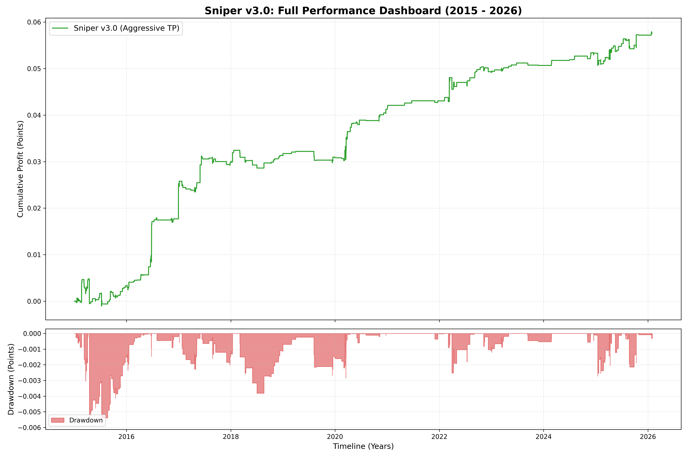
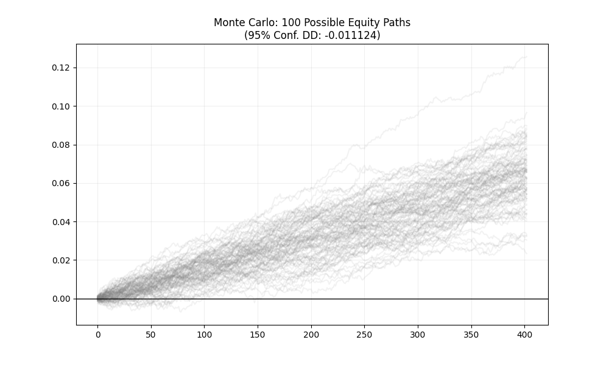

# 🎯 Sniper v3.0: High-Performance FX Mean Reversion Engine

**Sniper v3.0** is an end-to-end quantitative trading system for EURUSD (M1) that bridges the gap between theoretical research and execution reality. It utilizes **Numba-accelerated GPU kernels** for high-speed backtesting and an **XGBoost probabilistic filter** to refine entry quality.

---

## 🧠 Philosophy: Built on "Market Scars"
Most retail bots are built on vanity metrics. Sniper v3.0 is built on the hard-earned lessons of past failures—liquidations, slippage traps, and counterparty risks.

* **Survivor Mindset**: Prioritizes capital preservation (**Max Drawdown**) over raw profit.
* **Execution First**: Designed specifically to handle real-world frictions like **spread widening** and **latency**.
* **Anti-Fragility**: Validated through rigorous stress testing to ensure the strategy survives market regime shifts.

---

## ⚙️ Engineering & Tech Stack
* **GPU Parallel Computing**: Leverages **Numba (CUDA)** to process 4,000,000+ rows of M1 data in seconds, moving beyond CPU bottlenecks.
* **Machine Learning**: An **XGBoost Classifier** acts as a binary gatekeeper, allowing trades only when the historical probability of success exceeds **70%**.
* **Infrastructure**: Modular Python architecture with a dedicated **Live Executor** for MetaTrader 5 API integration.

---

## ⚔️ Strategy Logic (Triple-Barrier Method)
The strategy exploits short-term mean reversion inefficiencies with a strict exit framework:

* **Entry**: Signal triggered at $Z\text{-Score} > 2.2$ combined with high AI confidence.
* **Dynamic Take Profit**: Aggressive exit at $3.5 \times ATR$.
* **Defensive Stop Loss**: Tight protection at $1.5 \times ATR$.
* **Time Barrier**: Hard exit after **6 minutes** to prevent holding through noise.

---

## 📊 Performance & Risk Dashboard
*Historical Backtest (2015 - 2026) | Symbol: EURUSD (M1)*

| Metric | Value |
| :--- | :--- |
| **Profit Factor** | **1.887** |
| **Recovery Factor** | **> 16.0** |
| **Max Drawdown (Hist)** | **-0.0058 Points** |
| **95% Confidence DD** | **-0.0111 Points** |

---

## 📈 Equity Growth & Drawdown Intensity

*Figure 1: 11-year equity curve showing consistent growth and rapid recovery from drawdowns.*

## 🛡️ Monte Carlo Robustness Analysis (5,000 Paths)
To ensure the strategy is not curve-fitted, we randomized trade sequences to simulate 5,000 alternative futures.

*Figure 2: Probability distribution of returns, confirming a high survival rate across randomized regimes.*

---

## 📁 Repository Structure
```text
├── core/                # Numba CUDA Kernels & Strategy Logic
├── live/                # MT5 Live Executor & Daily Logging
├── scripts/             # Training, Preprocessing & Backtesting
├── models/              # XGBoost model weights (.json)
└── output/              # Performance plots & CSV Reports
